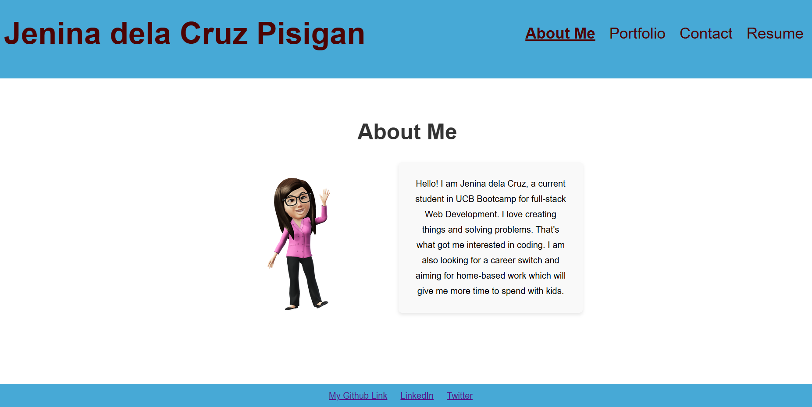

# MY-PORTFOLIO-WITH-REACT-APPLICATION
# [VIEW PORTFOLIO HERE](bucolic-muffin-3cdda2.netlify.app)

## Table of Contents
- [Description](#description)
- [Installation](#installation)
- [Usage](#usage)
- [Contributors](#contributing)
- [Questions](#questions)

## Description
This project is about my own portfolio that is build with `React`. It contains navigations that directs to different sections including sample works and resume.  

## Installation
No installation necessary. Just navigate to bucolic-muffin-3cdda2.netlify.app and visit the portfolio website.

## Usage
To use the application, click on the navigations link to be taken to different parts of the page. This includes a section where a visitor can send a message to the portfolio owner.

## Contributing
Contributions are welcome!!!

## Questions
  My GitHub profile is: Jenina52112 [View on GitHub](https://github.com/Jenina52112)

  For additional questions, contact me at email address: jen@gmail.com
